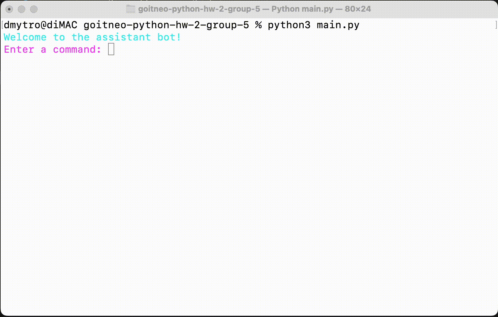

# goitneo-python-hw-2-group-5

## Task 1

Implemented advanced error handling in the console-based assistant bot using the input_error decorator.

## Task 2

Created classes to enhance data management in the CLI virtual assistant, setting the stage for future developments.  
To run tests use `classes.test.py` file